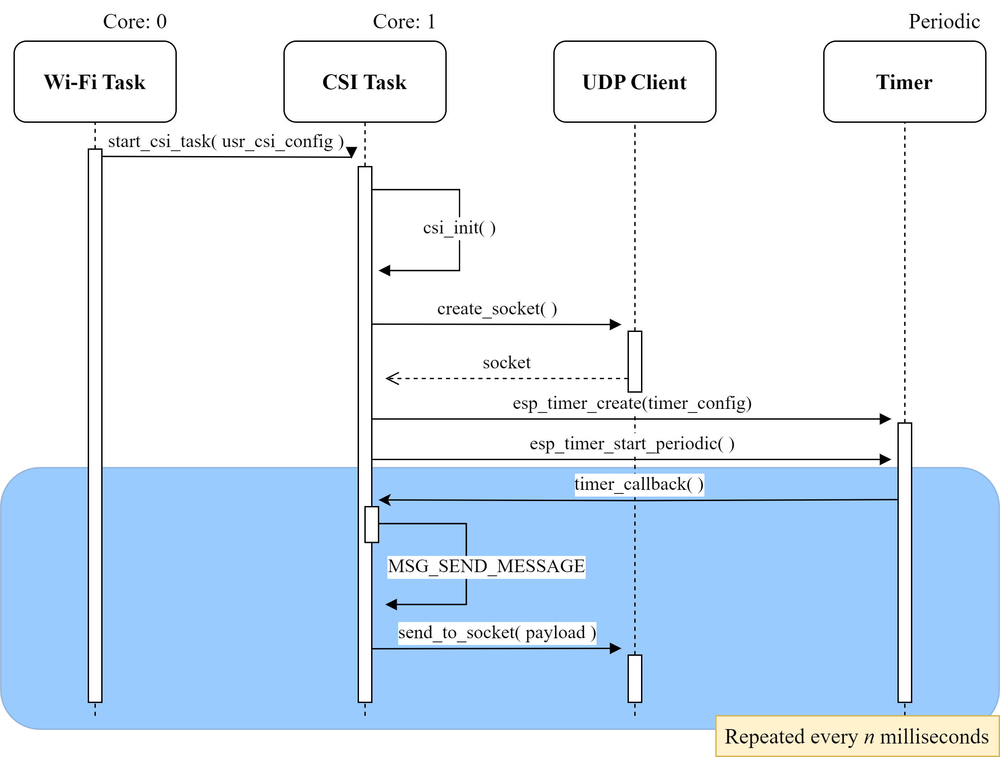
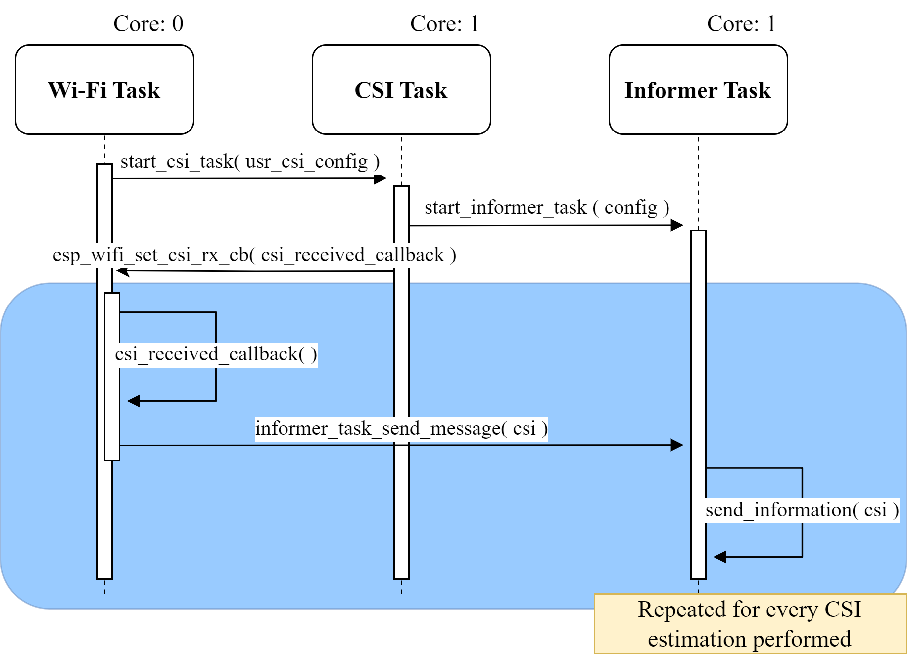
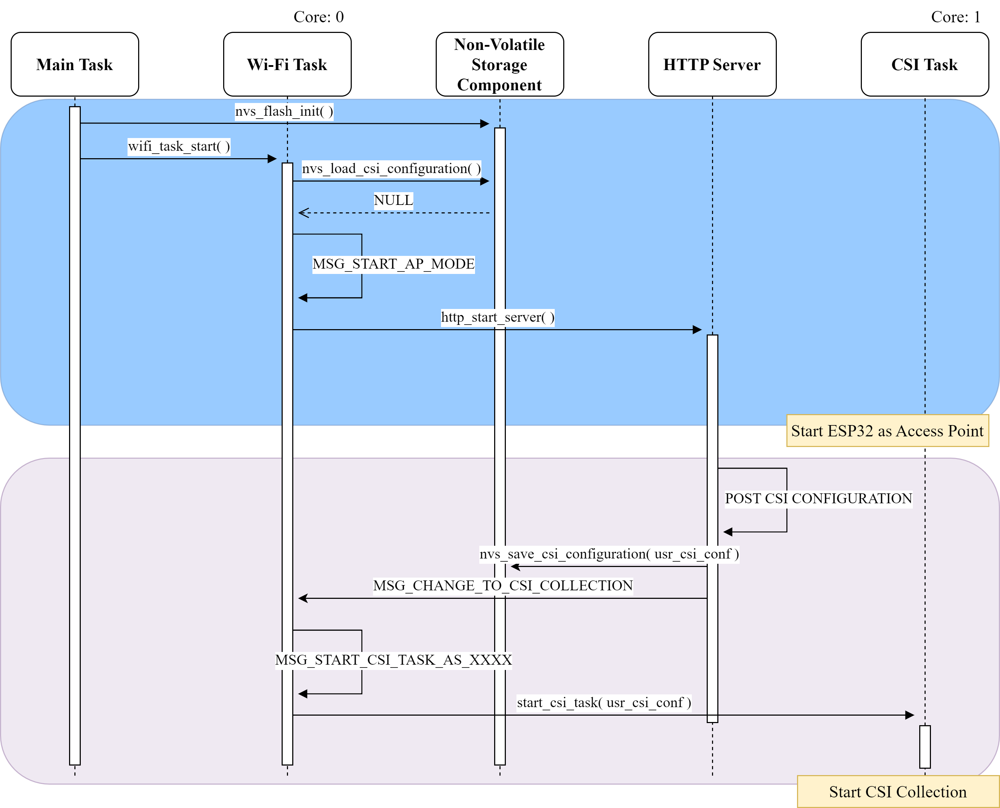

# ESP32 CSI Web Collecting Tool

Tool that leverages two ESP32 for collecting Wi-Fi CSI. Its parameters can be configured easily by an integrated webform that can be accessed through any browser.

It allows sending CSI data through its USB serial port, through GPIO pins by UART communication and SD storaging. 

## Content

The project inside main directory is structured as follows: 

```
├── main
│   ├── common          //Contains header files that define C structures and constants that are used all along the project.
│   │     └── utils.h
│   ├── components      //Header and source files for defining and configuring device components for communication and storing
│   │     ├── nvs_storage.c
│   │     ├── nvs_storage.h
│   │     ├── reset_button.c
│   │     ├── reset_button.h
│   │     ├── sd_component.c
│   │     ├── sd_component.h
│   │     ├── uart_component.c
│   │     ├── uart_component.h
│   │     ├── udp_client.c
│   │     └── udp_client.h
│   ├── tasks       //Header and source files that define the tasks running with FreeRTOS for tool functionality
│   │     ├── csi_app.c
│   │     ├── csi_app.h
│   │     ├── http_server.c
│   │     ├── http_server.h
│   │     ├── informer.c
│   │     ├── informer.h
│   │     ├── wifi_app.c
│   │     └── wifi_app.h
│   ├── webpage     //Files for the web page for tool configuration
│   │     ├── app.js
│   │     ├── bootstrap.min.css
│   │     ├── esp32.png
│   │     ├── favicon.ico
│   │     ├── index.html
│   │     └── jquery-3.3.1.min.js
│   ├── CMakeLists.txt
│   └── main.c
├── CMakeLists.txt
├── partitions.csv
└── README.md
```

## Components 

- **nvs_storage:** 
    Functions for saving and loading tool configuration for CSI collecting. 
- **reset_button:**
    Defines an ISR for resetting the devices and erasing the tool configuration from the NVS, allowing to define a new configuration. 
- **sd_component:**
    Handles SD operations, such as mounting and unmounting the SD; as well as file management when CSI is being stored in the SD. 
- **uart_component:** 
    Functions and constants for handling UART communication through the GPIO pins of the ESP32. 
- **udp_client:** 
    Handles communication between ESP32 for generating network UDP packets from which CSI is estimated. 

## Tasks

- **csi_app:** 
    The CSI task starts when the Wi-Fi task receives the configuration parameter values for collecting CSI and initiates the task accordingly. The functioning of this task varies depending on the device's operation mode. If the device is configured as Tx, it creates a socket using the User Datagram Protocol (UDP). This Internet communication protocol enables packets to be sent to the device configured as Rx. Then, it sets a software periodic timer, which invokes the callback function at a defined interval to send a packet through the socket to Rx. This leads to performing a CSI estimation for the received packet. The period at which the timer will invoke the callback function is defined as the inverse of the sampling rate submitted in the web form. The interactions between each task and component can be seen in the following figure: 

    

    On the other hand, when the device is configured as Rx, the CSI tasks help define a function that will be invoked as a callback by the Wi-Fi task when a UDP packet sent by the Tx is received, i.e., every CSI estimation is performed. The rest of the time, the task becomes idle, waiting to be stopped if a change in the operation mode is needed. Additionally, when the device is configured as Rx, the CSI task is also responsible for starting the Informer task, which is the task that sends or saves the estimated CSI. These interactions are described in the next figure:

     
    
- **http_server:**
    The HTTP Server registers Uniform Resource Identifiers (URIs) for fetching resources, such as the web page containing the web form or executing JavaScript functions to handle HTTP requests. One of the main URIs of the server is the one that handles a POST request, i.e., sends data to the server, which triggers when the Submit button of the web form is pushed. This request is sent to the server, i.e., the ESP32 working as an AP, a JSON file, which is a text value file that stores data in pairs of key and value, containing the tool configuration for collecting CSI. The server then notifies the Wi-Fi task to start CSI collection, setting the device operation mode to Rx or Tx. 

    To provide an in-depth understanding of the interactions between the Wi-Fi task and the HTTP Server, the following figure illustrates a sequence diagram that describes how these tasks interact with each other through function calls, return values, and message passing using task communication queues. 

    

- **informer:** 
    The Informer task is started by the CSI task when the device is configured as Rx. Depending on the Informer mode selected in the web form, this task will either set up an SD card for saving CSI estimations into a file or install and set the UART configuration for sending CSI to a second device with asynchronous serial communication via GPIO pins. Using the USB interface of the development boards does not require additional configuration from this task. 

    Once set, this task will receive the CSI from the Wi-Fi task and then save or send these estimations in the defined format, depending on the Informer mode. 

- **wifi_app:** 
    The Wi-Fi Task is responsible for starting every other tool task when needed. At device startup, this task checks if tool       configuration data has been created when the web form is submitted in the NVS. If configuration data can not be found, the device will start as an  AP with network parameters shown in the following table: 

    | Network Parameter | Value                |
    |-------------------|----------------------|
    | SSID              | CSI_Collecting_ESP32 |
    | Password          | root1234             |
    | Wi-Fi Channel     | 1                    |
    | Bandwidth         | 20MHz                |
    | IP address        | 192.168.1.1          |

    Furthermore, when configuring the tool, the Wi-Fi Task starts the HTTP Server to handle HTTP methods related to the web form. 
    However, if configuration data is found, the device will load the configuration defined previously through the web form. It will change to the respective operation mode for CSI collection, initiating the CSI Task. 

## Installation 

We encourage to use the ESP-IDF extension for VSCode, as it was used for the development of this project. An installation guide can be found in [Espressif official documentation](https://github.com/espressif/vscode-esp-idf-extension/#quick-installation-guide).

The devices used for obtaining the results reported in the paper are the ESP32-DevkitCVIE, which come with 8 MB of flash memory and 8 MB of PSRAM, as well as a connector for an external antenna. Although, the tool was also flashed to ESP32-S3 development boards and worked.  

**NOTE:** This project was developed with **ESP-IDF 5.4.1 version**.

## ESP-IDF Configuration


## Tool Configuration

